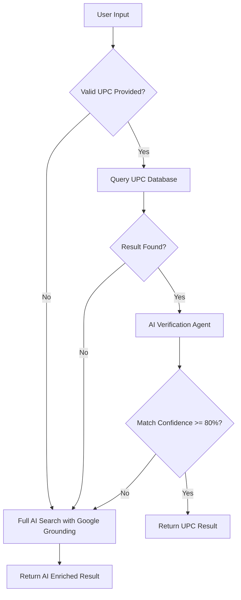
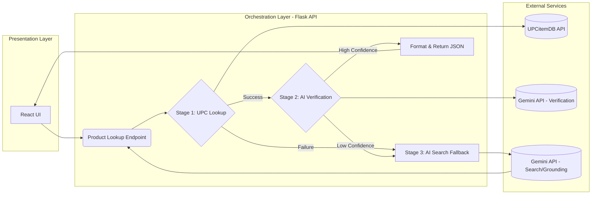

# Highstock Product Lookup - Backend API

Flask REST API that enriches product data using UPC database lookup with AI-powered web search fallback.

## Quick Start

```bash
# Install dependencies
pip install flask flask-cors anthropic requests python-dotenv

# Set API key
export ANTHROPIC_API_KEY="your_key_here"

# Run server
python flask_backend.py
```

Server runs on `http://localhost:5001`

## API Endpoint

**POST** `/api/lookup`

```json
{
  "productName": "Pro Filt'r Foundation",
  "brandName": "Fenty Beauty",
  "upc": "860004719699",
  "size": "30ml",
  "color": "190"
}
```

**Response:**
```json
{
  "product_name": "Fenty Beauty Pro Filt'r Foundation 30ml",
  "msrp": "$39.00",
  "image_url": ["https://..."],
  "description": "Product description...",
  "match_confidence": 100,
  "source": "UPC Item DB",
  "exact_match": true
}
```

## How It Works

1. **Primary**: Queries UPC Item Database (fast, 100% confidence)
2. **Fallback**: Uses Claude AI with web search if UPC lookup fails
3. Returns 404 if match confidence < 80%



## Requirements

```
flask==3.0.0
flask-cors==4.0.0
anthropic==0.40.0
requests==2.31.0
python-dotenv==1.0.0
```

## Testing

```bash
curl -X POST http://localhost:5001/api/lookup \
  -H "Content-Type: application/json" \
  -d '{"productName":"Foundation","brandName":"Fenty","upc":"860004719699"}'
```

## Configuration

- Change port: Edit line `app.run(debug=True, port=5001)`
- Adjust confidence threshold: Modify line `match_confidence, 0) < 70`
- Customize CORS: `CORS(app, origins=["https://yourdomain.com"])`
